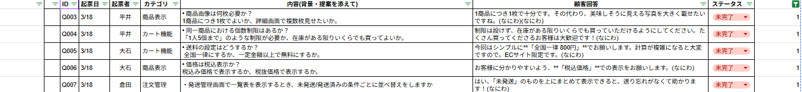

# ECサイト 基本仕様書

## 0. はじめに（背景と目的）

■ 現状の課題
現在、店舗で販売している特産品は電話やFAXで注文を受けているため、
以下の課題が発生している。
・営業時間外の注文ができない
・注文内容の聞き間違いや記録ミスが発生する
・在庫管理が手動で非効率

■ 導入の目的
オンライン販売システムを導入することで、
・24時間注文受付を可能にする
・注文・在庫管理の自動化による業務効率化
・販売機会の拡大による売上向上
を実現する。

## 1.概要
- 本システムは、店舗で販売している特産品をインターネット上で購入できるオンライン販売システムです。
- 営業時間外でも注文可能にし、在庫管理や注文処理のミスを減らします。
 
## 2.登場人物(ユーザーロール)
| ロール | 説明 | 可能な操作 |
|---|---|---|
| **利用者** |利用者|商品閲覧、商品詳細閲覧、購入、購入内容確認|
<!-- | **未ログインユーザー** |ログインしていないユーザー|商品閲覧、商品詳細閲覧、購入、購入内容確認| -->
<!-- | **一般ユーザー** | ログイン済みのユーザー| 新規登録、ログイン、商品閲覧、購入、購入内容確認 | -->
| **管理者** | ECサイトの運営者 | ログイン、商品の登録・編集・削除、配送状況の管理|

## 3．画面遷移図
### ECサイト

### 管理サイト

## 4.各画面の機能詳細
### EC001.商品一覧画面
- 商品一覧を表示（商品名・価格・商品情報（商品名や画像、在庫情報などを含む））
- 「おすすめ商品」を最大3件、目立つ位置に表示
- カテゴリ・価格帯による商品の絞り込み機能
- 在庫がない商品は表示しない
- 商品をカートへ追加する機能

### EC002.商品詳細画面〇
- 商品名、価格、商品詳細、画像を表示
- カートに入れる際の個数設定
- 戻るをクリックすると商品一覧画面に戻る
  
### EC003.カート
- カート内の商品名、価格、画像を一覧で表示
- 商品を複数カートに追加可能
- 数量変更・削除が可能
- 小計・送料・税金・合計金額を表示
- レジへ進むをクリックすると注文内容確認画面へ遷移

<!-- ### EC004.ログイン
- ユーザーID、パスワードを入力
- ユーザーID情報はセッション内で保持
- 認証成功で商品一覧画面へ遷移
- 認証失敗時はエラーメッセージ表示
#### 認証内容(入力可能な内容)
- ユーザーID(入力必須)
- パスワード(入力必須)

### EC005.ユーザー登録画面
- 名前、電話番号
- パスワードを入力
- 登録成功でログインページに遷移
- バリデーションエラー表示
- #### 認証内容(入力可能な内容)
- 名前(入力必須、文字列のみ、50文字以内での入力)
- パスワード(入力必須、8文字以上、ハッシュ化)
- 電話番号(入力必須、ハイフンなしの数字のみ、11文字以内での入力)
- 住所(入力必須、50文字以内での入力) -->

<!-- ### EC006.注文状況管理
- 自分の注文履歴を表示(注文内容、合計金額、お届け先)
- 注文ごとのステータス（未発送／発送済み）を表示 -->
   
### EC007.決済画面
<!-- - ログインユーザーのみアクセス可能 -->
- 決済完了メッセージ表示
  
### EC008.注文内容確認画面
<!-- - ログインユーザーのみアクセス可能 -->
<!-- - お届け先情報(名前・住所・電話番号)をユーザー情報から取得(変更がある場合には編集可能) -->
- お届け先情報・お支払い情報の入力機能(毎回入力・クレジットのみ)
- 注文内容の一覧表示
- 合計金額の表示
- 「注文確定」ボタンを押すと決済画面へ遷移
- 遷移時にデータベース内の在庫数の更新
- 遷移時にデータベースに注文内容を登録
- 遷移時にカート情報の初期化
- お届け先情報の編集時に入力内容の認証を実施(入力必須)
#### 認証内容(入力可能な内容)
- 名前(入力必須、文字列のみ、50文字以内での入力)
- 住所(入力必須、50文字以内での入力)
- 電話番号(入力必須、ハイフンなしの数字のみ、11文字以内での入力)
- クレジットカード番号(入力必須、16桁の数字のみ)
  

### AD001.ログイン画面
- 管理者用のログインフォーム
- 一般ユーザーは存在しない
- ユーザーID、パスワードを入力
- 認証成功で発送管理画面へ遷移
- 認証失敗時はエラーメッセージ表示
- #### 認証内容(入力可能な内容)
- ユーザーID(入力必須)
- パスワード(入力必須)

### AD003.商品管理メニュー
- 商品の追加・編集・削除
- 商品名・価格・商品情報の変更が可能
- 在庫数を管理

### AD004.注文管理
- 名前、配送情報、注文内容、合計金額の表示
- 配送ステータスの編集
  
### ヘッダー
- ロゴのクリック時、商品一覧ページへ遷移
- 商品画像のクリック後、商品詳細画面へ遷移
- 注文状況をクリック後、注文状況管理画面へ遷移
- カートをクリック後、注文内容確認画面へ遷移
- ログアウトボタンをクリック後、ログイン画面へ遷移

## 5. 共通仕様・エラー
### 共通仕様
<!-- - 未ログイン状態で「カート」と「注文状況」へアクセスしようとした場合、ログイン画面へリダイレクトされる。
- ログイン状態はセッションで管理
- パスワードはハッシュ化して保存 -->
- 
### エラー発生時
<!-- - 権限のないページへアクセスした場合は、403 Forbidden エラーとなる。 -->
- 存在しないURLにアクセスした場合は404 Not Found
- サーバーエラー発生時は500 Internal Server Error
- 入力エラー時は各画面でバリデーションメッセージ表示

